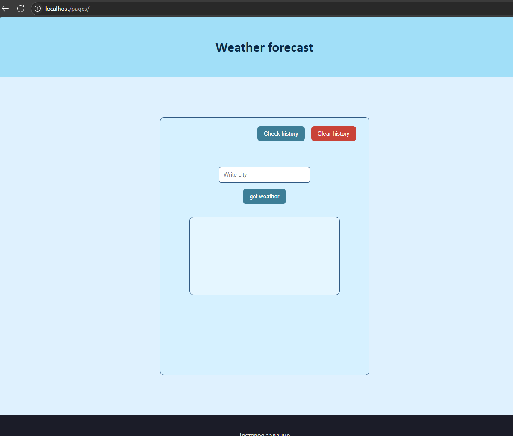
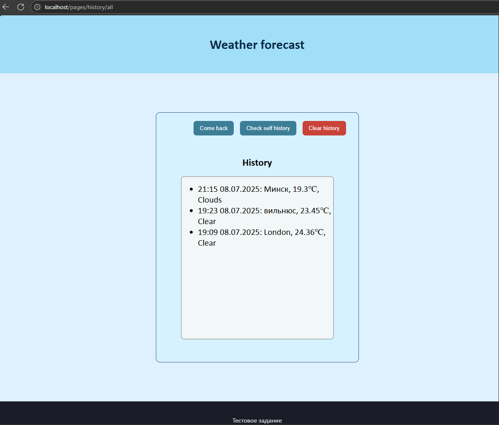

Weather forecast app
===


   

---
[English](#EN) | [Русский](#RU)

---

#### EN

## Table of Contents

1. [Overview](#1-project-overview)  
2. [Deployment and Launch](#2-deployment)  
   2.1 [General Notes](#21-general)  
   2.2 [Running Without Docker](#22-running-without-docker)  
   2.3 [Running With Docker](#23-running-with-docker)  
3. [User Guide](#3-user-guide)  
4. [API Documentation](#4-api-documentation)  
5. [Technologies Used](#5-technologies-used)
<br>

---

---

<br>

[glob]: +

## 1. Project Overview

This project is a small-scale test assignment with the following primary goals:

- A page for entering a city name and displaying its current weather
- A page for viewing the history of weather requests
- Fetching weather data via an external API (OpenWeather was used)
- Storing request results in a PostgreSQL database

<br>

Additionally, the following features were implemented:

- Viewing personal request history
- Ability to clear your own request history
- Docker Compose setup for easy deployment
- Redis caching for the history page to improve performance

<br><br><br>

**P.S.** While some elements might seem excessive for a project of this scale, my main intention was to showcase my code structure, architectural approach, and the technologies I'm familiar with.

<br>

---
<br>

[deploy_and_run]: +
## 2. Deployment  

### 2.1 General

#### Steps:
1. Open your command line.

3. Navigate to the directory where you plan to deploy the project.  
   - For example:  
   ```bash
   cd C:\Users\Your_Username\Desktop
   ```
3. Enter the command:  
   ```bash
   git clone https://github.com/ShapMiki/worktask-Weather.git
    ```
4. After cloning, navigate to the root directory of the project:

    ```bash
    cd worktask-Weather
    ```
5. Obtain access to the OpenWeather API by registering on OpenWeather and getting your (free) API key.
    - OpenWeather registration: [OpenWeather Registration](https://home.openweathermap.org/users/sign_up)
    - API key management: [API Keys](https://home.openweathermap.org/api_keys)

[run_server_cmd]: +
### 2.2 Running Without Docker

1. Make sure you have Python version 3.9 or higher installed.

 It is recommended to create a virtual environment

(While in the root directory of the project "PATH_TO_PROJECT/worktask-Weather") you need to run the following commands:

- To create the virtual environment:
    ```bash
    python -m venv venv  
    ```

- To activate the environment:
    For Windows:
    ```bash
    venv\Scripts\activate
    ```
    For Linux:
    ```bash
    source venv/bin/activate
    ```
2. Install the project dependencies by running:

   For Windows:
   ```bash
   pip install -r requirements.txt
   ```

   For Linux:
   ```bash
   pip3 install -r requirements.txt
   ```

3. Ensure that PostgreSQL and Redis are installed on your system:
   - PostgreSQL installation guide: [PostgreSQL Installation](https://www.postgresql.org/download/)
   - Redis installation guide: [Redis Installation](https://redis.io/docs/getting-started/installation/)

    Redis must be running for the site to work. (And also PostgreSQL if the deployment is being done on Linux)


4. Creating the .env file  
   - In the root directory of the project "PATH_TO_PROJECT/worktask-Weather", create a file named ".env" and add the following lines:

   ```env
   DB_HOST=POSTGRES_HOST (usually localhost)
   DB_PORT=POSTGRES_PORT (usually 5432)
   DB_USER=POSTGRES_USER (usually postgres)
   DB_PASSWORD=POSTGRES_PASSWORD (usually postgres)
   DB_NAME=POSTGRES_DB_NAME (usually postgres)

   REDIS_HOST=REDIS_HOST (usually localhost)
   REDIS_PORT=REDIS_PORT (usually 6379)

   hour_zone=TIMEZONE_OFFSET (e.g., 3 for UTC+3, -3 for UTC-3, etc.)

   api_key=YOUR_OPENWEATHER_API_KEY
   ```
- Replace the uppercase placeholders with the values you set during PostgreSQL and Redis installation.

- Replace "YOUR_OPENWEATHER_API_KEY" with the API key you obtained from the OpenWeather website.

- The timezone offset is the difference between your local time and UTC. For example, Moscow is 3 (UTC+3), New York is -5 (UTC-5), etc.

5. To create the database, run the following command in the root directory of the project:
```bash
  alembic upgrade head
```

6. Start the server by running(in the root directory of the project ):

```bash
uvicorn app.main:app --host 0.0.0.0 --port 80 --reload
```
- 0.0.0.0 can be replaced with the IP address of your PC or server. Using 0.0.0.0 listens on all IP addresses of your interfaces.
- 80 is the port the server will run on. You can change it to any available port (e.g., 8000).

7. After successful startup, open your browser and go to:
```
http://localhost
```
- Or, if you changed the IP address or port, replace localhost with your IP address, followed by : and the port number.

Example: http://192.100.0.102:8000


[run_server_docker]: +
### 2.3 Running with Docker
1. Ensure Docker is installed and running  
   - Docker installation guide: [Docker Installation](https://docs.docker.com/get-docker/)  
2. In the project's root directory `PATH_TO_PROJECT/worktask-Weather`, create a `.env` file with the following content:  
```env
DB_HOST=db
DB_PORT=5432
DB_USER=POSTGRESQL_USERNAME (typically postgres)
DB_PASSWORD=POSTGRESQL_PASSWORD (typically postgres)
DB_NAME=POSTGRESQL_DATABASE_NAME (typically postgres)

REDIS_HOST=redis
REDIS_PORT=6379

hour_zone=TIMEZONE_OFFSET (e.g., 3 for UTC+3, -3 for UTC-3)

api_key=YOUR_OPENWEATHER_API_KEY
```

  - Replace all CAPITALIZED placeholders:
    - YOUR_OPENWEATHER_API_KEY → Your actual OpenWeather API key.
  - Remove inline comments, keeping only values in the final file.

   3. Run the following command in your terminal(in the root directory of the project):
```bash
docker-compose up --build
```
   4. After successful launch, open your browser and navigate to:
```
http://localhost:80
```
- If you're using Docker on a remote server, replace "localhost" with your server's IP address
- You can also use your hostname instead of localhost (if configured) or your local PC's IP address (if running on a personal computer)
<br>

---

<br>

[client_docs]: +
## 3. User Guide

### Weather Forecast Page
Page access paths:
- Navigate to /pages (http://localhost/pages)
- Navigate to / (http://localhost)
- Clicking the "come back" button on the history page
- Clicking the logo in the site header on the history page

Description:
Page for obtaining current weather in a specified city

The page displays a form for entering a city name. After entering and clicking the "get weather" button, a request is made to the OpenWeather API, and the current weather for the specified city is displayed in the block below.

When clicking the "Check history" button, you'll be redirected to the request history page.
When clicking the "Clear history" button, the current user's request history will be cleared.


<br>


### Request History Page
Page access paths:
- Navigate to `/pages/history/self` (http://localhost/pages/history/self) - to view personal history
- Navigate to `/pages/history/all` (http://localhost/pages/history/all) - to view all users' history
- Clicking the "Check history" button on the main page
- Clicking the logo in the site header on the main page

Description:
Page for viewing the current user's request history and all users' request history

When clicking the "Check all history" button, the bottom block will display all users' request history
When clicking the "Check self history" button, the bottom block will display your personal request history
When clicking the "Clear history" button, the current user's request history will be cleared



---
[api_docs]: +
### 4. API Documentation

#### User
- **DELETE** `/api/user/`  
  Clears user history by removing the `id` record from cookies.

#### Weather
- **GET** `/api/weather/current/{city}`  
  Retrieves current weather for specified city.  
  **Parameters:**
  - `city` — name of city to get weather for.
  
<br>

---

<br>

[technologies]: +
### 5. Technologies Used

- **FastAPI** - Core web framework
- **Jinja2** - HTML templating engine
- **aioredis** - Asynchronous Redis client
- **Pydantic** - Data schemas and validation
- **SQLAlchemy** - Database models and ORM
- **Uvicorn** - ASGI server
- **Alembic** - Database migrations
- **Docker** - Application containerization
- **Git** - Version control system

<br>

---

#### RU
Сайт прогноза погоды
===


   

---


---


## Содержание

1. [Общее описание](#1-описание-программы)  
2. [Развёртывание](#2-развёртывание)<br>
   2.1 [Общее](#21-общее)<br>
   2.2 [Запуск без Docker](#22-запуск-без-докера)<br>
   2.3 [Запуск с помощью docker](#23-запуск-с-помощью-docker)<br>
3. [Руководство пользователя](#3-руководство-пользователя)<br>
4. [API документация](#4-api-документация)<br>
5. [Технологии](#5-технологии)<br>

<br>

---

---

<br>

[glob]: +

## 1. Описание программы:

Данный проект представляет собой тестовое задание, в котором главными целями были:

- Страница на которой вводиться название города и отображается погода в ней
- Страница с оторажением истории запросов о погоде
- Получение данных о погоде с помощью API (Использовался API от OpenWeather)
- Сохранение результатов запросов в базу данных PostgreSQL

<br>

Дополнительно было реализованно:

- Просмотр личной истории запросов
- Возможность очистки собственной истории запросов
- Docker-compose - для упрощения развёртывания проекта 
- Redis - для кэширования страниц с историей запросов

<br><br><br>

P.S. Некоторые элементы проекта могут казаться избыточными для такого небольшого масштаба, однако моя основная цель — продемонстрировать свой подход к архитектуре, стиль написания кода и технологии, с которыми я умею работать.

<br>

---
<br>

[deploy_and_run]: +
## 2. Развёртывание
<br>

[us]: +
### 2.1 Общее

#### Шаги:
1. Откройте командную строку
2. Перейдите в директорию в которой планируется развёртывание проекта
   - Например, ``` cd C:\Users\Имя_пользователя\Desktop ```
3. Введите команду 
``` git clone https://github.com/ShapMiki/worktask-Weather.git```
4. После скачивания введите команду ``` cd worktask-Weather ``` - переход в корневую директорию проекта
5. Получите доступ к API OpenWeather, зарегистрировавшись на сайте [OpenWeather](https://openweathermap.org/api) и получите свой(бесплатный) API ключ.
<br>

[run_server_cmd]: +
### 2.2 Запуск без докера

1. Убедитесь, что у вас установлен Python версии 3.9 или выше


 Рекомендуется создание виртуальной среды
   
(Находясь в корневой директории проекта "ПУТЬ_К_ПРОЕКТУ/worktask-Weather") Нужно выполнить команды
- Для Содания:
    ```bash
  python -m venv venv  
  ```

- Для запуска:
    Для Windows:
    ```bash
    venv\Scripts\activate
    ```
    Для Linux:
    ```bash
    source venv/bin/activate
    ```
   

2. Установите зависимости проекта, выполнив команду:
Для Windows:
```bash
pip install -r requirements.txt
```
Для Linux:
```bash
pip3 install -r requirements.txt
```

3. Убедитесь, что у вас установлен PostgreSQL и Redis
   - иструкция по установке PostgreSQL: [PostgreSQL Installation](https://www.postgresql.org/download/) 
   - инструкция по установке Redis: [Redis Installation](https://redis.io/docs/getting-started/installation/)
   
 Для работы сайта, Redis нужно запустить. (А так же PostgreSQL если развертывание происходит на linux)
   


4. Создание .env файла
   - В корневой директории проекта "ПУТЬ_К_ПРОЕКТУ/worktask-Weather" создайте файл с именем ".env" и добавьте в него следующие строки:
```env
DB_HOST= ХОСТ_ДЛЯ_ПОДКЛЮЧЕНИЯ_К_POSTGRESQL (обычно localhost)
DB_PORT= ПОРТ_ДЛЯ_ПОДКЛЮЧЕНИЯ_К_POSTGRESQL (обычно 5432)
DB_USER= ИМЯ_ПОЛЬЗОВАТЕЛЯ_ДЛЯ_POSTGRESQL (обычно postgres)
DB_PASSWORD= ПАРОЛЬ_ДЛЯ_POSTGRESQL (обычно postgres)
DB_NAME= ИМЯ_БАЗЫ_ДАННЫХ_ДЛЯ_POSTGRESQL (обычно postgres)

REDIS_HOST=ХОСТ_ДЛЯ_ПОДКЛЮЧЕНИЯ_К_REDIS (обычно localhost)
REDIS_PORT=ПОРТ_ДЛЯ_ПОДКЛЮЧЕНИЯ_К_REDIS (обычно 6379)

hour_zone=ЧАСОВОЙ_ПОЯС (например: 3 (для UTC+3), -3 (для UTC-3) и т.д.)

api_key=ВАШ_API_КЛЮЧ_ОТ_OPENWEATHER
```
   -  Значения написанные большим шрифтом необходимо заменить на значения которые вы казывали при установке PostgreSQL и Redis:
   - Замените "ВАШ_API_КЛЮЧ_ОТ_OPENWEATHER" на ваш API ключ, полученный на сайте OpenWeather.
   - Часовой пояс - это разница между вашим местным временем и временем UTC. Например, для Москвы это 3 (UTC+3), для Нью-Йорка -5 (UTC-5) и т.д.
- дополнительные комментарии к полям нужно убрать, чтоб остались только значения
<br>

5. Для создания базы данных выполните команду в корневой директории проекта:
```bash
alembic upgrade head
```

6. Запустите сервер, выполнив команду(в корневой директории проекта):
```bash
uvicorn  app.main:app --host  0.0.0.0 --port 80 --reload
```
- 0.0.0.0 - можно заменить на доступный вам ip адрес вашего ПК или сервера, 0.0.0.0 - для прослушивания всех ip адресов ваших интерфесов

- 80 - порт на котором будет запущен сервер, можно заменить на любой другой порт (который не занят, например: 8000)

7. После успешного запуска, откройте браузер и перейдите по адресу: 
```
http://localhost
```
- либо, если вы изменили ip адрес или порт, то замените "localhost" на ваш ip адрес, а после него ":" и порт

  - например: ```http://192.100.0.102:8000```


[run_server_docker]: +
### 2.3 Запуск с помощью docker
   1. Убедитесь, что у вас установлен и запущен Docker
      - инструкция по установке Docker: [Docker Installation](https://docs.docker.com/get-docker/)
   2. В корневой директории проекта "ПУТЬ_К_ПРОЕКТУ/worktask-Weather" создайте файл с именем ".env" и добавьте в него следующие строки: 
```env
DB_HOST=db
DB_PORT= 5432 
DB_USER= ИМЯ_ПОЛЬЗОВАТЕЛЯ_ДЛЯ_POSTGRESQL (обычно postgres)
DB_PASSWORD= ПАРОЛЬ_ДЛЯ_POSTGRESQL (обычно postgres)
DB_NAME= ИМЯ_БАЗЫ_ДАННЫХ_ДЛЯ_POSTGRESQL (обычно postgres)

REDIS_HOST=redis
REDIS_PORT=6379

hour_zone=ЧАСОВОЙ_ПОЯС (например: 3 (для UTC+3), -3 (для UTC-3) и т.д.)

api_key=ВАШ_API_КЛЮЧ_ОТ_OPENWEATHER
```
   - Значения написанные большим шрифтом необходимо заменить на свои значения:
   - Замените "ВАШ_API_КЛЮЧ_ОТ_OPENWEATHER" на ваш API ключ, полученный на сайте OpenWeather.
   - дополнительные комментарии к полям нужно убрать, чтоб остались только значения
   3. Запустите команду в терминале:
```bash
docker-compose up --build
```
   4. После успешного запуска, откройте браузер и перейдите по адресу: 
```
http://localhost:80
```
   - Если вы используете Docker на удалённом сервере, замените "localhost" на IP-адрес вашего сервера.
   - Так же вместо localhost можно использовать имя хоста, если оно настроено либо ip адрес вашего ПК(если запуск производится на личном пк).

<br>

---

<br>

[client_docs]: +
## 3. Руководство пользователя

### Страница с прогнозом погоды
пути к странице: 
- переход на /pages (http://localhost/pages)
- переход на / (http://localhost)
- нажитие кнопки "come back" на странице с историей
- нажитие на логотип в шапке сайта на странице с историей

Описание:
Страница для получения текущей погоды в указанном городе

На странице отображается форма для ввода названия города. После ввода и нажатия кнопки "get weather" происходит запрос к API OpenWeather, и отображается текущая погода в указанном городе в блоке снизу.

При нажатии на кнопку "Check history" происходит переход на страницу с историей запросов.
При нажатии на кнопку "Clear history" происходит очистка истории запросов текущего пользователя.


<br>


### Страница с историей запросов
пути к странице: 
- переход на /pages/history/self (http://localhost/pages/history/self) - для просмотра личной истории
- переход на /pages/history/all (http://localhost/pages/history/all) - для просмотра истории всех пользователей
- нажитие кнопки "Check history" на главной странице
- нажитие на логотип в шапке сайта на главной странице

Описание:
Страница для просмотра истории запросов текущего пользователя и истории запросов всех пользователей

При нажатии на кнопку "Check all history" в блоке снизу отобразиться история запросов всех пользователей
При нажатии на кнопку "Check self history" в блоке снизу отобразится ваша история запросов
При нажатии на кнопку "Clear history" произойдёт очистка истории запросов текущего пользователя


---
[api_docs]: +
### 4. API документация

#### User
- **DELETE** `/api/user/`  
  Удаление истории пользователя путём удаления записи `id` из cookie.

#### Weather
- **GET** `/api/weather/current/{city}`  
  Получение текущей погоды для указанного города.  
  **Параметры:**
  - `city` — название города, для которого нужно вернуть погоду.
  
<br>

---

<br>

[technologies]: +
### 5. Технологии

- FastAPI — основной фреймворк.
- Jinja2 — шаблонизатор для HTML.
- aioredis — асинхронный клиент Redis.
- Pydantic — для схем и валидации данных.
- SQLAlchemy — для моделей и работы с БД.
- Uvicorn — ASGI сервер.
- Alembic — миграции БД
- Docker — для контейнеризации приложения.
- Git — для контроля версий.

<br>

---

