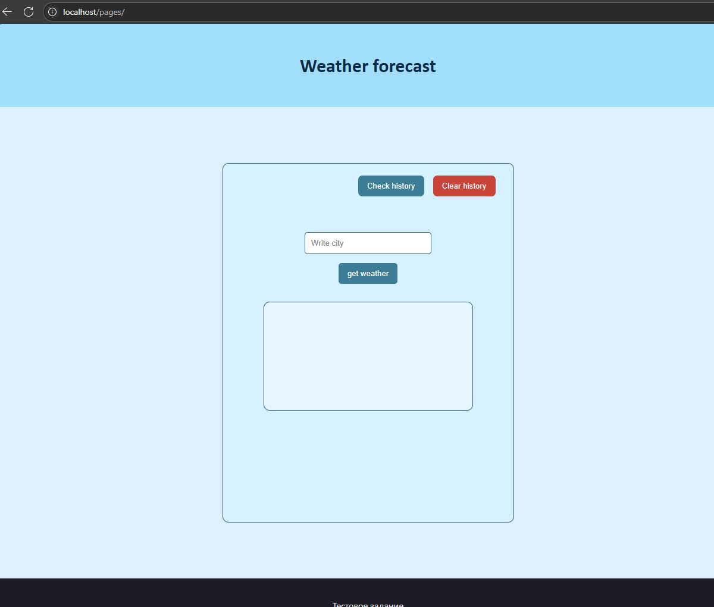
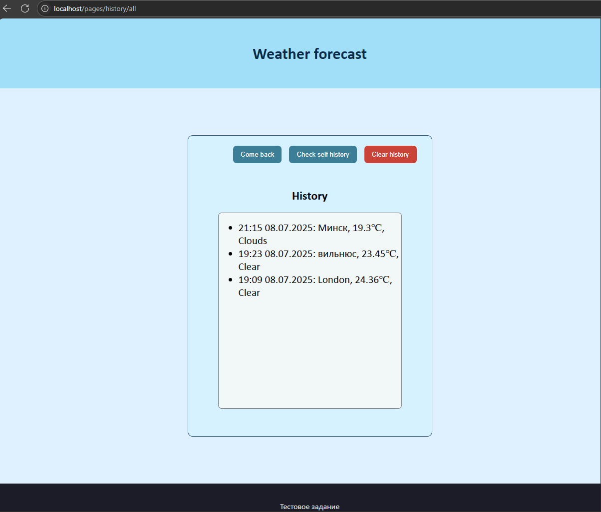

Сайт прогноза погоды
===


   

---


---


## Содержание

1. [Общее описание][glob]
2. [Развёртывание][deploy_and_run]<br>
   2.1 [Общее][us]<br>
   2.2 [Запуск без Docker][run_server_cmd] <br>
   2.3 [Запуск с помощью docker][run_server_docker] <br>
3. [Руководство пользователя][client_docs] <br>
4. [API документация][api_docs] <br>
5. [Технологии][technologies] <br>

<br>

---

---

<br>

[glob]: +

## 1. Описание программы:

Данный проект представляет собой тестовое задание, в котором главными целями были:

- Страница на которой вводиться название города и отображается погода в ней
- Страница с оторажением истории запросов о погоде
- Получение данных о погоде с помощью API (Использовался API от OpenWeather)
- Сохранение результатов запросов в базу данных PostgreSQL

<br>

Дополнительно было реализованно:

- Просмотр личной истории запросов
- Возможность очистки собственной истории запросов
- Docker-compose - для упрощения развёртывания проекта 
- Redis - для кэширования страниц с историей запросов

<br><br><br>

P.S. Некоторые элементы проекта могут казаться избыточными для такого небольшого масштаба, однако моя основная цель — продемонстрировать свой подход к архитектуре, стиль написания кода и технологии, с которыми я умею работать.

<br>

---
<br>

[deploy_and_run]: +
## 2. Развёртывание
<br>

[us]: +
### 2.1 Общее

#### Шаги:
1. Откройте командную строку
2. Перейдите в директорию в которой планируется развёртывание проекта
   - Например, ``` cd C:\Users\Имя_пользователя\Desktop ```
3. Введите команду 
``` git clone https://github.com/ShapMiki/worktask-Weather.git```
4. После скачивания введите команду ``` cd worktask-Weather ``` - переход в корневую директорию проекта
5. Получите доступ к API OpenWeather, зарегистрировавшись на сайте [OpenWeather](https://openweathermap.org/api) и получите свой(бесплатный) API ключ.
<br>

[run_server_cmd]: +
### 2.2 Запуск без докера

1. Убедитесь, что у вас установлен Python версии 3.9 или выше
2. Установите зависимости проекта, выполнив команду:
Для Windows:
```bash
pip install -r requirements.txt
```
Для Linux:
```bash
pip3 install -r requirements.txt
```

3. Убедитесь, что у вас установлен PostgreSQL и Redis
   - иструкция по установке PostgreSQL: [PostgreSQL Installation](https://www.postgresql.org/download/) 
   - инструкция по установке Redis: [Redis Installation](https://redis.io/docs/getting-started/installation/)
   
 Для работы сайта, Redis нужно запустить
   


4. Создание .env файла
   - В корневой директории проекта "ПУТЬ_К_ПРОЕКТУ/worktask-Weather" создайте файл с именем ".env" и добавьте в него следующие строки:
```env
DB_HOST= ХОСТ_ДЛЯ_ПОДКЛЮЧЕНИЯ_К_POSTGRESQL (обычно localhost)
DB_PORT= ПОРТ_ДЛЯ_ПОДКЛЮЧЕНИЯ_К_POSTGRESQL (обычно 5432)
DB_USER= ИМЯ_ПОЛЬЗОВАТЕЛЯ_ДЛЯ_POSTGRESQL (обычно postgres)
DB_PASSWORD= ПАРОЛЬ_ДЛЯ_POSTGRESQL (обычно postgres)
DB_NAME= ИМЯ_БАЗЫ_ДАННЫХ_ДЛЯ_POSTGRESQL (обычно postgres)

REDIS_HOST=ХОСТ_ДЛЯ_ПОДКЛЮЧЕНИЯ_К_REDIS (обычно localhost)
REDIS_PORT=ПОРТ_ДЛЯ_ПОДКЛЮЧЕНИЯ_К_REDIS (обычно 6379)

hour_zone=ЧАСОВОЙ_ПОЯС (например: 3 (для UTC+3), -3 (для UTC-3) и т.д.)

api_key=ВАШ_API_КЛЮЧ_ОТ_OPENWEATHER
```
   -  Значения написанные большим шрифтом необходимо заменить на значения которые вы казывали при установке PostgreSQL и Redis:
   - Замените "ВАШ_API_КЛЮЧ_ОТ_OPENWEATHER" на ваш API ключ, полученный на сайте OpenWeather.
   - Часовой пояс - это разница между вашим местным временем и временем UTC. Например, для Москвы это 3 (UTC+3), для Нью-Йорка -5 (UTC-5) и т.д.
- дополнительные комментарии к полям нужно убрать, чтоб остались только значения
<br>

5. Для создания базы данных выполните команду в корневой директории проекта:
```bash
alembic upgrade head
```

6. Запустите сервер, выполнив команду:
```bash
uvicorn  app.main:app --host  0.0.0.0 --port 80 --reload
```
- 0.0.0.0 - можно заменить на доступный вам ip адрес вашего ПК или сервера, 0.0.0.0 - для прослушивания всех ip адресов ваших интерфесов

- 80 - порт на котором будет запущен сервер, можно заменить на любой другой порт (который не занят, например: 8000)

7. После успешного запуска, откройте браузер и перейдите по адресу: 
```
http://localhost
```
- либо, если вы изменили ip адрес или порт, то замените "localhost" на ваш ip адрес, а после него ":" и порт

  - например: ```http://192.100.0.102:8000```


[run_server_docker]: +
### 2.3 Запуск с помощью docker
   1. Убедитесь, что у вас установлен и запущен Docker
      - инструкция по установке Docker: [Docker Installation](https://docs.docker.com/get-docker/)
   2. В корневой директории проекта "ПУТЬ_К_ПРОЕКТУ/worktask-Weather" создайте файл с именем ".env" и добавьте в него следующие строки: 
```env
DB_HOST=db
DB_PORT= 5432 
DB_USER= ИМЯ_ПОЛЬЗОВАТЕЛЯ_ДЛЯ_POSTGRESQL (обычно postgres)
DB_PASSWORD= ПАРОЛЬ_ДЛЯ_POSTGRESQL (обычно postgres)
DB_NAME= ИМЯ_БАЗЫ_ДАННЫХ_ДЛЯ_POSTGRESQL (обычно postgres)

REDIS_HOST=redis
REDIS_PORT=6379

hour_zone=ЧАСОВОЙ_ПОЯС (например: 3 (для UTC+3), -3 (для UTC-3) и т.д.)

api_key=ВАШ_API_КЛЮЧ_ОТ_OPENWEATHER
```
   - Значения написанные большим шрифтом необходимо заменить на свои значения:
   - Замените "ВАШ_API_КЛЮЧ_ОТ_OPENWEATHER" на ваш API ключ, полученный на сайте OpenWeather.
   - дополнительные комментарии к полям нужно убрать, чтоб остались только значения
   3. Запустите команду в терминале:
```bash
docker-compose up --build
```
   4. После успешного запуска, откройте браузер и перейдите по адресу: 
```
http://localhost:80
```
   - Если вы используете Docker на удалённом сервере, замените "localhost" на IP-адрес вашего сервера.
   - Так же вместо localhost можно использовать имя хоста, если оно настроено либо ip адрес вашего ПК(если запуск производится на личном пк).

<br>

---

<br>

[client_docs]: +
## 3. Руководство пользователя

### Страница с прогнозом погоды
пути к странице: 
- переход на /pages (http://localhost/pages)
- переход на / (http://localhost)
- нажитие кнопки "come back" на странице с историей
- нажитие на логотип в шапке сайта на странице с историей

Описание:
Страница для получения текущей погоды в указанном городе

На странице отображается форма для ввода названия города. После ввода и нажатия кнопки "get weather" происходит запрос к API OpenWeather, и отображается текущая погода в указанном городе в блоке снизу.

При нажатии на кнопку "Check history" происходит переход на страницу с историей запросов.
При нажатии на кнопку "Clear history" происходит очистка истории запросов текущего пользователя.


<br>


### Страница с историей запросов
пути к странице: 
- переход на /pages/history/self (http://localhost/pages/history/self) - для просмотра личной истории
- переход на /pages/history/all (http://localhost/pages/history/all) - для просмотра истории всех пользователей
- нажитие кнопки "Check history" на главной странице
- нажитие на логотип в шапке сайта на главной странице

Описание:
Страница для просмотра истории запросов текущего пользователя и истории запросов всех пользователей

При нажатии на кнопку "Check all history" в блоке снизу отобразиться история запросов всех пользователей
При нажатии на кнопку "Check self history" в блоке снизу отобразится ваша история запросов
При нажатии на кнопку "Clear history" произойдёт очистка истории запросов текущего пользователя



---
[api_docs]: +
### 4. API документация

#### User
- **DELETE** `/api/user/`  
  Удаление истории пользователя путём удаления записи `id` из cookie.

#### Weather
- **GET** `/api/weather/current/{city}`  
  Получение текущей погоды для указанного города.  
  **Параметры:**
  - `city` — название города, для которого нужно вернуть погоду.
  
<br>

---

<br>

[technologies]: +
### 5. Технологии

- FastAPI — основной фреймворк.
- Jinja2 — шаблонизатор для HTML.
- aioredis — асинхронный клиент Redis.
- Pydantic — для схем и валидации данных.
- SQLAlchemy — для моделей и работы с БД.
- Uvicorn — ASGI сервер.
- Alembic — миграции БД
- Docker — для контейнеризации приложения.
- Git — для контроля версий.

<br>

---

